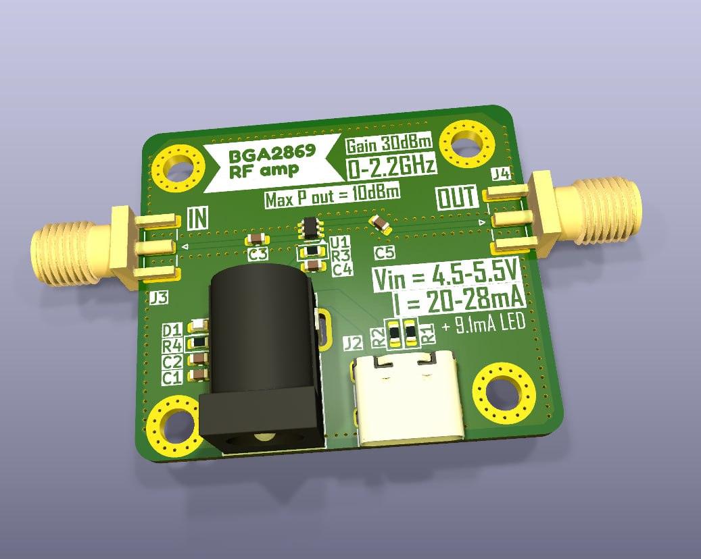
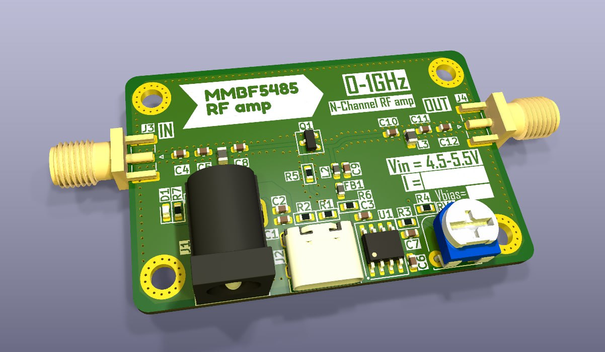
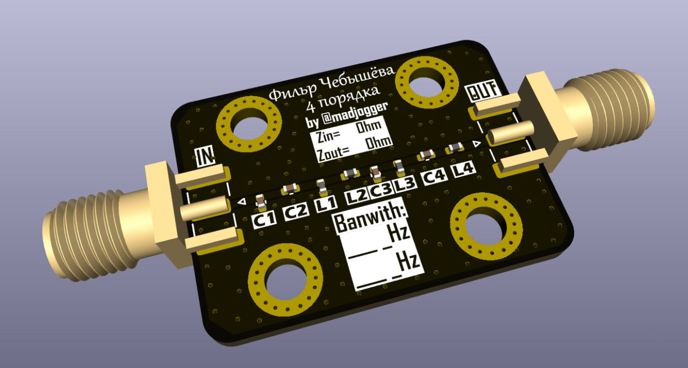
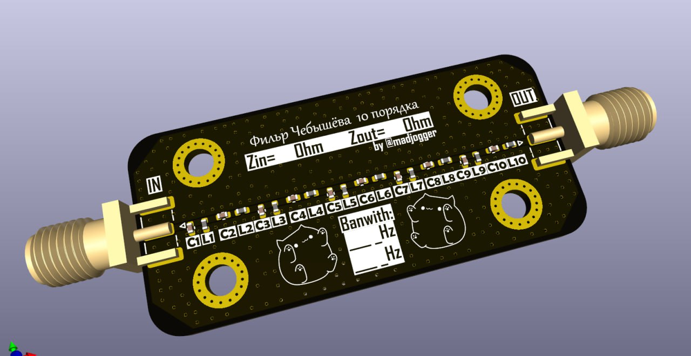

# RF-modules

**Серия экспериментальных ВЧ-плат: широкополосные усилители и пассивные фильтры Чебышёва.**

Небольшая коллекция тестовых радиочастотных плат, собранная в процессе погружения в тему ВЧ-усилителей и согласования сигналов. Идея — спроектировать набор готовых строительных блоков (усилитель, транзисторный каскад, фильтры), чтобы в нужный момент сразу взять проверенный модуль с полки. Каждая плата оформлена как отдельный проект внутри репозитория.

## Состав репозитория

| Папка | Тип | Краткое описание |
|---|---|---|
| `BGA2869 amplifier` | Усилитель | MMIC-усилитель BGA2869, DC–2.2 ГГц, ~30 dB |
| `MMBF5485 amplifier` | Усилитель | Каскад на N-канальном ВЧ JFET MMBF5485 + обвязка |
| `Chebyshev_4_filter` | Фильтр | LC-фильтр Чебышёва 4-го порядка |
| `Chebyshev_10_filter` | Фильтр | LC-фильтр Чебышёва 10-го порядка |

---

## BGA2869 amplifier

Широкополосный усилитель на MMIC **BGA2869** (NXP) — недорогой и удобный «кирпичик» усиления с внутренним согласованием на 50 Ω, не требующий внешних согласующих цепей и выходного дросселя.

**Характеристики**

| Параметр | Значение |
|---|---|
| Активный элемент | BGA2869 (NXP MMIC, SOT363) |
| Полоса | DC … 2.2 ГГц |
| Усиление | ~31.7 dB @ 950 МГц |
| Коэффициент шума | 3.1 dB @ 950 МГц |
| Выходная мощность (P1dB) | ~10 dBm @ 950 МГц |
| Согласование | внутреннее, 50 Ω (вход/выход) |
| Питание | 5 В (~24 мА) |
| Вход питания | USB и DC-Jack |

Применение: универсальный широкополосный блок усиления, IF-усилитель, второй каскад после LNA. Сам чип стоит около 100 руб — плата получается очень бюджетной.

---

## MMBF5485 amplifier

Каскад на N-канальном ВЧ JFET **MMBF5485** (семейство 2N5484/5485/5486) с цепями смещения и согласования. Экспериментальная плата — основная цель проверить транзистор в роли ВЧ-усилителя. Если по усилению результат не устроит, обвязка спроектирована так, что плату можно переиспользовать как фильтр/согласующий модуль.

**Характеристики**

| Параметр | Значение |
|---|---|
| Активный элемент | MMBF5485 (N-канальный JFET, SOT-23) |
| Назначение | ВЧ-усилитель VHF/UHF диапазона |
| VGS(off) | −0.5 … −4 В |
| Крутизна (gfs) | от ~3.5 мС |
| Согласование | дискретная обвязка вход/выход |
| Резервное использование | фильтр / согласующий модуль |

---

## Фильтры Чебышёва (4 и 10 порядка)

Пассивные LC-фильтры с характеристикой Чебышёва: версии **4-го** (`Chebyshev_4_filter`) и **10-го** (`Chebyshev_10_filter`) порядков. Сделаны как готовые фильтрующие блоки на 50 Ω, чтобы держать под рукой для отладки и согласования трактов.

| Параметр | Chebyshev_4_filter | Chebyshev_10_filter |
|---|---|---|
| Тип | LC-фильтр Чебышёва | LC-фильтр Чебышёва |
| Порядок | 4 | 10 |
| Импеданс | 50 Ω | 50 Ω |
| Крутизна склона | пологая | крутая (больше секций) |

> 💡 Удобный онлайн-калькулятор LC-фильтров с подбором реальных номиналов компонентов:
> https://markimicrowave.com/technical-resources/tools/lc-filter-design-tool/

---

## Среда разработки

- **Схема и плата:** KiCad
- **Подбор фильтров:** Marki Microwave LC Filter Design Tool
- **Документация на компоненты:** datasheet BGA2869 (NXP), MMBF5485 (Fairchild/onsemi)
